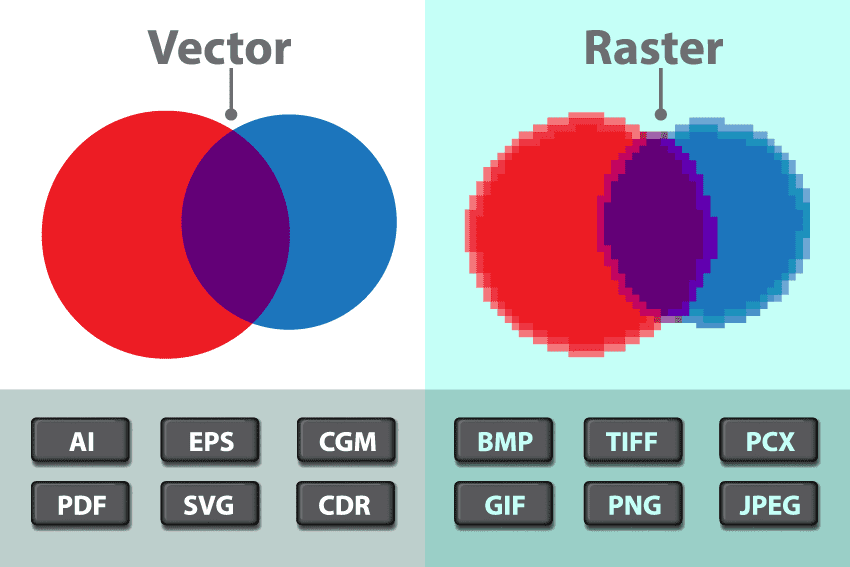

= Research: 2-Dimensional Navigation

The goal is to visualize the route to the destination in a 2 Dimensional image. So the user is able to see a map between two points.

== Introduction to Vector Drawables

*Vector Drawables*, as their name implies, are based on vector graphics, as opposed to raster graphics. We all are familiar with raster graphics in the assortment of PNG, JPEG and other image files.

* Raster graphics describe the actual color value of each pixel of an image, whereas vector graphics contain the recipe, using a series of draw commands, to create the result.
* To display the result, the system converts it back at runtime to the same pixel data through a process called rasterization.
* The recipes that make vector drawables are directly written in an XML format.

.battery.xml
[source,xml]
----
<!-- res/drawable/battery_charging.xml -->
<vector xmlns:android="http://schemas.android.com/apk/res/android"
    <!-- intrinsic size of the drawable -->
    android:height="24dp"
    android:width="24dp"
    <!-- size of the virtual canvas -->
    android:viewportWidth="24.0"
    android:viewportHeight="24.0">
   <group
         android:name="rotationGroup"
         android:pivotX="10.0"
         android:pivotY="10.0"
         android:rotation="15.0" >
      <path
        android:name="vect"
        android:fillColor="#FF000000"
        android:pathData="M15.67,4H14V2h-4v2H8.33C7.6,4 7,4.6 7,5.33V9h4.93L13,7v2h4V5.33C17,4.6 16.4,4 15.67,4z"
        android:fillAlpha=".3"/>
      <path
        android:name="draw"
        android:fillColor="#FF000000"
        android:pathData="M13,12.5h2L11,20v-5.5H9L11.93,9H7v11.67C7,21.4 7.6,22 8.33,22h7.33c0.74,0 1.34,-0.6 1.34,-1.33V9h-4v3.5z"/>
   </group>
</vector>
----

=== The problem with PNG's

The PNG format assets being used in Android apps have an native size and their quality is dependent on pixels. Each PNG asset that we use is specific to a certain density, which is why we provide
different versions of the same image for different screen densities. Simple said, we generate multiple copies of the same image with different sizes.
image:https://miro.medium.com/max/2716/0*K4GMcQPsBQpZ9-l2[alt="Battery Charging PNG.", width=500]

=== Vector Assets: the Solution

To overcome the raster graphics, where an image defines set of pixels in grid, we can use vector drawable to define image using points, lines and curves along with color information.
Image scalability is one of the most important features as different devices have different dimension. Vector assets scales with no pixelation or blur issue, as it defines an image in xml file where
the image shape is defined based on which it's rendered on the screen.

==== Vector asset benefits:

Vector assets are more preferable than traditional bitmaps because they are sharp, small and animatable.

* Sharp: Vector assets are independent of pixels and textual, so they will be sharper on any density.
* Small: A single version of vector asset instead of mulbitple PNG's, so the size of assets on APK will be very less.
* Animatable: Textual and contains paths that we can use for animations.

==== Vector Assets Rendering Process:

The vector will be compiled to binary format at compile time and at runtime, the app loads this up, generates a model object from binary code,
and perform some canvas operations to draw the individual paths to the screen.

==== Vector Formats: SVG & Android Vector Drawables

*SVG* is an acronym for **S**calable **V**ector **G**raphics which is an older and standardized practice on the web to provide scalable images.
The SVG's contain a path specification which is a drawing command that builds most of the SVG image.

Android supports its own format called *vector drawable*, which is a XML file that consists of a single vector node and consists of one or multiple path elements in it.
Vector drawables are defined in the tree hierarchy similar to SVG format. Vector drawable is made up of path and group.

* Each *path* contains the geometry of the object's outline.
* *Group*: contains details for transformation.

.Convert SVG To Vector Drawable Android.
[NOTE]
===============================
With the help of the Vector Asset tool, we can convert the SVG’s to vector drawables in seconds.

Visit this  https://developer.android.com/studio/write/vector-asset-studio[link^] for more information.
===============================
