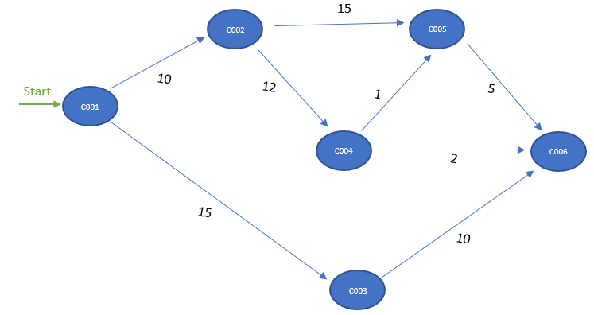
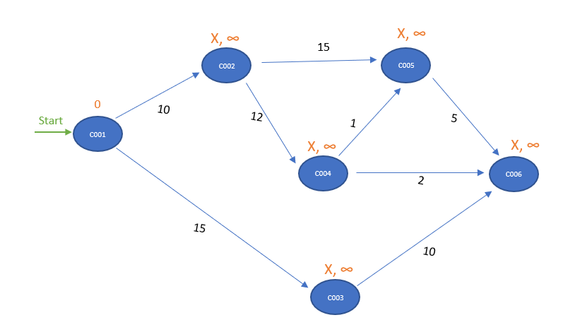
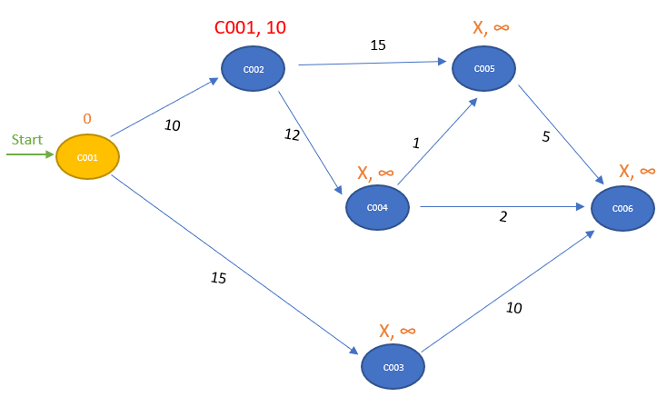
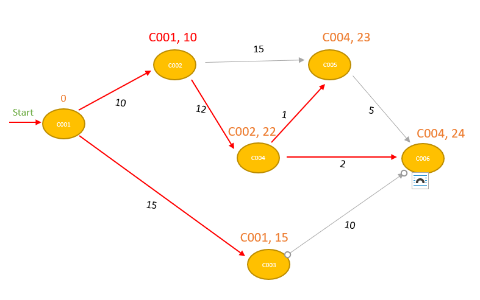

= Research: Find Shortest Path Problem

The basic goal is to determine the shortest path between a starting node, and the rest of the graph, which is a
theoretic problem known to graph.

== Dijkstra Shortest Path Algorithm

*Dijkstra* algorithm a.k.a. *SPF* algorithm (Shortest Path First) is an algorithm for finding the shortest path
between nodes in a graph. Which in our case represents the Campus Proximus indoor path network.
The core idea is to continuously wipe out the longer paths between the starting node and all possible destinations.

Given a positively weighted graph and a starting Node(C001), SPF determines the shortest path and distance from the source to all destinations in graph.

- To keep track of process, two distinct sets of nodes are needed:
. *Settled nodes*: are the ones with a known minimum distance from the source.
. *Unsettled nodes*: gathers nodes that we can reach from the source. BUT with no knowledge about the min distance from the starting node.

=== Steps to follow in order to determine SPF:

. Set distance to start node to 0.
. Set all other distances to '∞' value.
. Add StartNode to unsettled nodes set.
. While (unsettled nodes set !== empty):
* Choose an evaluation node from the unsettled nodes.
- evaluation node == node with the lowest distance from source.
* Calculate distances to direct neighbors by keeping the lowest distance at each evaluation.
* Add neighbors that are not settled to the unsettled nodes set.

==== Initialization

We need to initialize all nodes with an infinite number distance and an unknown predecessor,
except de start node. For Node 'C001' we assign the value 0.
All the nodes except 'C001' will be distinguished with a predecessor *'X'* and a distance *'∞'*.

To complete initialization process, add node 'C001' to the unsettled nodes set. So it gets picked first in the evaluation step.

.Initialization Notes.
[NOTE]
===============================
. The distance from node C001 to C001 is 0.
. Settled nodes set is still empty.
===============================

==== Evaluation

After initializing the graph, pick the node with the lowest distance value from the unsettled nodes set, then we
evaluate all neighboring nodes that are not in settled nodes set:

Add the edge weight to the evaluation node distance, then compare it to the destination's distance.

*Example:* For node 'C002': 0 + 10 < ∞ , so the new distance for 'C002' is 10 and new predecessor is 'C001'

- Node 'C001' is moved from unsettled set to settled set.
- Nodes 'C002' and 'C003' are added to the unsettled set. They can be reached, but they need to be evaluated.
- We have now two nodes in unsettled set, we take the one with the lowest distance 'C002', then we reiterate until we settle all nodes in the graph.
- Summarize the iterations that were performed during evaluation steps:

.Dijkstra Table
[options="header,footer"]
|=======================
|Iteration        | Unsettled         | Settled                       | Evaluation Node   | C001    | C002      | C003      | C004        | C005        | C006
|1                | C001              | -                             | C001              | 0       | C001 - 10 | c001 - 15 | X - ∞       | X - ∞       | X - ∞
|2                | C002, C003        | C001                          | C002              | 0       | C001 - 10 | X - ∞     | C002 - 22   | X - ∞       | c002 - 25
|3                | C003, C005, C004  | C001, C002                    | C003              | 0       | C001 - 10 | X - ∞     | X - ∞       | C003 - 25   | X - ∞
|4                | C004, C006, C005  | C001, C002, C003              | C004              | 0       | C001 - 10 | X - ∞     | X - ∞       | c004 - 24   | C004 - 23
|5                | C006, C005        | C001, C002, C003, C004        | C006              | 0       | C001 - 10 | X - ∞     | X - ∞       | X - ∞       | X - ∞
|6                | C006              | C001, C002, C003, C004, c005  | C005              | 0       | C001 - 10 | X - ∞     | X - ∞       | X - ∞       | X - ∞
|Final            | -                 | All                           | NONE              | 0       | C001 - 10 |c001 - 15  | C002 - 22   | c004 - 24   |C004 - 23
|=======================

.Dijkstra Table Notes.
[NOTE]
===============================
- The notation C002-22, for example, means that node C002 is the immediate predecessor, with a total distance of 22 from node C001.
- We can calculate the shortest paths from node C001 are as follows:
* Node C002 : C001 –> C002 (total distance = 10)
* Node C003 : C001 –> C003 (total distance = 15)
* Node C004 : C001 –> C002 –> C004 (total distance = 22)
* Node C005 : C001 –> C002 –> C004 –> C006 (total distance = 24)
* Node C006 : C001 –> C002 –> C004 –> C005 (total distance = 23)
===============================

== JAVA IMPLEMENTATION

.Node.class
[source,JAVA]
----
import java.util.HashMap;
import java.util.Map;
import java.util.concurrent.atomic.AtomicInteger;

public class Node {

    private static final AtomicInteger count = new AtomicInteger(0);
    private final int id;
    private String name;
    private Integer distance = Integer.MAX_VALUE;
    private Map<Node, Integer> adjacentNodes = new HashMap<>();

    public Node(String name) {
        this.name = name;
        id = count.incrementAndGet();
    }
    public int getAdjacentNodeDistance(Node node) {
        return adjacentNodes.get(node);
    }
    public int getId() {
        return id;
    }

    public void addDestination(Node destination, int distance) {
        adjacentNodes.put(destination, distance);
    }

    public String getName() {
        return name;
    }

    public void setName(String name) {
        this.name = name;
    }

    public Map<Node, Integer> getAdjacentNodes() {
        return adjacentNodes;
    }

    public void setAdjacentNodes(Map<Node, Integer> adjacentNodes) {
        this.adjacentNodes = adjacentNodes;
    }

    public Integer getDistance() {
        return distance;
    }

    public void setDistance(Integer distance) {
        this.distance = distance;
    }
}
----

.Graph.class
[source,JAVA]
----
import java.util.HashMap;

public class Graph {
    private HashMap<Integer ,Node> nodes = new HashMap<>();

    public void addNode(Node nodeA) {
        nodes.put(nodeA.getId(), nodeA);
    }

    public HashMap<Integer,Node> getNodes() {
        return nodes;
    }

    public void setNodes(HashMap<Integer, Node> nodes) {
        this.nodes = nodes;
    }
    public Node getNodeById(int id) {
        return nodes.get(id);
    }
}
----

.Dijkstra.class
[source,JAVA]
----
import java.util.*;

public class Dijkstra {
    private final int[][] tomatrix;

    public Dijkstra(int[][] matrix) {
        if (matrix == null || matrix.length == 0 || matrix.length != matrix[0].length) {
            throw new IllegalArgumentException();
        }

        this.tomatrix = matrix.clone();
    }

    private int[][] initMatrixDijkstra(int startLocation) {
        int[][] res = new int[this.tomatrix.length + 1][this.tomatrix.length];
        // to initialize start location first set first row with infinite value, to find the SPF
        for (int i = 0; i < this.tomatrix.length; i++)
            res[0][i] = Integer.MAX_VALUE;
        for (int i = 1; i <= this.tomatrix.length; i++) {
            for (int j = 0; j < this.tomatrix.length; j++) {
                if (this.tomatrix[i - 1][j] == Integer.MAX_VALUE){
                    res[i][j] = 0;
                }
                else{
                    res[i][j] = this.tomatrix[i - 1][j];
                }
            }
        }

        for (int i = 0; i < this.tomatrix.length; i++) {
            res[i][startLocation - 1] = 0;
        }
        return res;
    }

    public int[][] algorithm(int startLocation) {
        int[][] res = initMatrixDijkstra(startLocation);
        System.out.println("Initialization matrix: \n");
        printIntMatrix(res);
        boolean ok = false; while (!ok) {
            int indexSmallestJ = 0;
            int indexSmallestI = 0;
            int smallest = Integer.MAX_VALUE;
            for (int i = 0; i < this.tomatrix.length; i++) {
                if (res[0][i] != Integer.MAX_VALUE) {
                    // Evaluation phase:
                    // search for all nodes for which there is no shortest path yet from nodes that might still have, together with smallest distance
                    for (int j = 0; j < this.tomatrix.length; j++) {
                        if (res[i + 1][j] != 0 && res[0][j] == Integer.MAX_VALUE)
                            if (res[0][i] + res[i + 1][j] < smallest) {
                                indexSmallestJ = j;
                                indexSmallestI = i + 1;
                                smallest = res[0][i] + res[i + 1][j];
                            }
                    }
                }
            }
            if (smallest == Integer.MAX_VALUE) {
                ok = true;
            } else {
                res[0][indexSmallestJ] = smallest;
                for (int i = 1; i <= this.tomatrix.length; i++)
                    if (i != indexSmallestI){
                        res[i][indexSmallestJ] = 0;
                    }
            }
        }
        return res;
    }

    private ArrayList<String> findPathString(int startLocation, int toLocation, int[][] res, HashMap<Integer, Node> nodes) {
        ArrayList<String> pad = new ArrayList<>();
        pad.add(nodes.get(toLocation).getName());
        while (toLocation != startLocation) {
            int k = 1;
            while (k < res.length && res[k][toLocation - 1] == 0)
                k++;
            pad.add(0, nodes.get(k).getName());
            toLocation = k;
        }
        return pad; }

    public String calculatePaths(int startLocation, HashMap<Integer, Node> nodes) {
        String uit = "";
        int[][] res = this.algorithm(startLocation);

        System.out.println("Evaluation matrix: \n");
        printIntMatrix(res);

        for (int i = 0; i < res[0].length; i++) {
            if ((i + 1) != startLocation) {
                if (res[0][i] == Integer.MAX_VALUE) {
                    uit += "There is no path from " + nodes.get(startLocation).getName()  + " to " + nodes.get(i + 1).getName() + "\n";
                } else {
                    uit += "Shortest distance from " + nodes.get(startLocation).getName() + " to " + nodes.get(i + 1).getName() + " = " + res[0][i] + "\n";
                    uit += "via ";

                    int j = (i + 1);
                    ArrayList<String> pad = findPathString(startLocation, j, res, nodes);
                    uit += pad + "\n";
                }
            }
        }
        return uit;
    }

    private static void printIntMatrix(int[][] matrix) {
        String result ="";
        for (int i = 0; i < matrix.length; i++) {
            for (int j = 0; j < matrix[0].length; j++) {
                result += (matrix[i][j] == Integer.MAX_VALUE ? "inf" : matrix[i][j]) + "\t";
            }
            result += "\n";
        }
        result += "\n";

        System.out.println(result);
    }

    public List<String> getPath(int startLocation, int destination, HashMap<Integer, Node> nodes) {
        List<String> out = new ArrayList<>();
        int[][] matrix = this.algorithm(startLocation);
        System.out.println("Evaluation matrix: \n");
        printIntMatrix(matrix);

        for (int i = 0; i < matrix[0].length; i++) {
            if ((i + 1) != startLocation) {
                if (matrix[0][i] == Integer.MAX_VALUE) {
                } else {
                    int j = (i + 1);
                    if (j == destination) {
                        out = findPathString(startLocation, j, matrix, nodes);
                    }
                }
            }
        }
        return out;
    }

    private ArrayList<Node> findpath(int startLocation, int toLocation, int[][] res, HashMap<Integer, Node> nodes) {
        ArrayList<Node> path = new ArrayList<>();
        path.add(nodes.get(toLocation));
        while (toLocation != startLocation) {
            int k = 1;
            while (k < res.length && res[k][toLocation - 1] == 0)
                k++;
            path.add(0, nodes.get(k));
            toLocation = k;
        }
        return path; }
}
----
.Solution.class
[source,JAVA]
----
public class Oplossing {
    public static void main(String[] args) {
        Node C001 = new Node("C001");
        Node C002 = new Node("C002");
        Node C003 = new Node("C003");
        Node C004 = new Node("C004");
        Node C005 = new Node("C005");
        Node C006 = new Node("C006");

        C001.addDestination(C002, 10);
        C001.addDestination(C003, 15);

        C002.addDestination(C004, 12);
        C002.addDestination(C006, 15);

        C003.addDestination(C005, 10);

        C004.addDestination(C005, 2);
        C004.addDestination(C006, 1);

        C006.addDestination(C005, 5);

        Graph graph = new Graph();

        graph.addNode(C001);
        graph.addNode(C002);
        graph.addNode(C003);
        graph.addNode(C004);
        graph.addNode(C005);
        graph.addNode(C006);

        int [][] m = new int[graph.getNodes().size()][graph.getNodes().size()];
        for (int i = 0; i < m.length; i++) {
            Node ni = graph.getNodeById(i+1);
            for (int j = 0; j < m[i].length; j++) {
                Node nj = graph.getNodeById(j+1);
                if (!ni.getAdjacentNodes().containsKey(nj)) {
                    m[i][j] = 0;
                } else {
                    m[i][j] = ni.getAdjacentNodeDistance(nj);
                }
            }
        }
        Dijkstra haha = new Dijkstra(m);

        System.out.println("\n All paths: \n");
        System.out.println(haha.calculatePaths(C004.getId(), graph.getNodes()));

    }
}
----

.Output
[source,JAVA]
----
All paths:

Initialization matrix:

inf	inf	inf	0	inf	inf
0	10	15	0	0	0
0	0	0	0	0	15
0	0	0	0	10	0
0	0	0	0	2	1
0	0	0	0	0	0
0	0	0	0	5	0

Evaluation matrix:

inf	inf	inf	0	2	1
0	10	15	0	0	0
0	0	0	0	0	0
0	0	0	0	0	0
0	0	0	0	2	1
0	0	0	0	0	0
0	0	0	0	0	0

There is no path from C004 to C001
There is no path from C004 to C002
There is no path from C004 to C003
Shortest distance from C004 to C005 = 2
via [C004, C005]
Shortest distance from C004 to C006 = 1
via [C004, C006]
----
