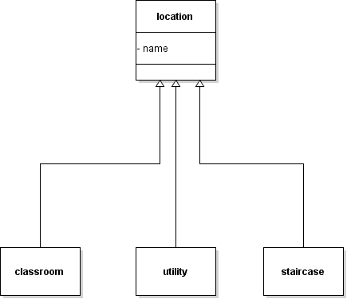

STORY B01. NAVIGATION
---------------------
As a user

I want to be able to select start-location and end-location

so that I can see the route Details.

WIREFRAMES:
~~~~~~~~~~~

image:img/sb01.png[alt="Android Screen.",width=450,height=300]

ACCEPTANCE CRITERIA:
~~~~~~~~~~~~~~~~~~~~
-	On the starting point input, I should be able to select a location
-	On the destination input, I should be able to select my destination point.
-	After clicking on Find shortest route, Details page opens.
-	In the Details, A route description will be shown as a list.

TECHNICAL DETAILS:
~~~~~~~~~~~~~~~~~~
Domain en db classes:
^^^^^^^^^^^^^^^^^^^^^

