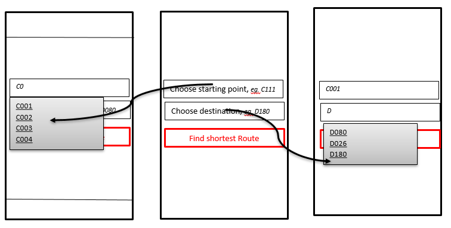

USER STORY B01. Localization
----------------------------
As a *user*

I *want* to select locations from input list

so that I *can navigate* between the points.

ACCEPTANCE CRITERIA:
~~~~~~~~~~~~~~~~~~~~

Scenario 1:  Valid starting point and destination point list.
^^^^^^^^^^^^^^^^^^^^^^^^^^^^^^^^^^^^^^^^^^^^^^^^^^^^^^^^^^^^^
*Given* a user +
*When* user types the code-name of classroom that user is at the moment
in _'Choose starting point'_  or code-name of classroom
that he wants to be in _'Choose destination'._ +
*Then* a selectable list of locations based on input value will be shown.

WIREFRAMES:
~~~~~~~~~~~

TECHNICAL DETAILS:
~~~~~~~~~~~~~~~~~~
- Use this topic to make the input autocomplete option: https://www.geeksforgeeks.org/autocompletetextview-in-kotlin/[AutoCompleteTextView in Kotlin
^]
