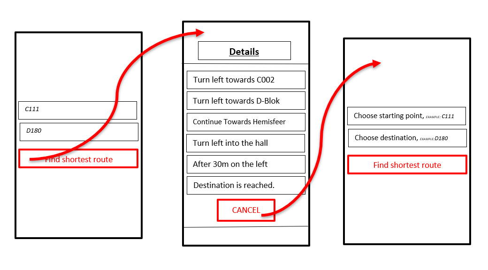

USER STORY B02. TEXT-Based Navigation
--------------------------------------
As a *user*

I *want* to go to details page

so that, I can see a text-based navigation between two points.

ACCEPTANCE CRITERIA:
~~~~~~~~~~~~~~~~~~~~

Scenario 1:
^^^^^^^^^^^
*Given* a user +
*When* the user clicks on _'Find shortest Route'_ button +
*Then* a list of steps to be taken to reach destination will be shown.

Scenario 2:
^^^^^^^^^^^
*Given* a user +
*When* the user clicks on _'Cancel'_ button on details page +
*Then* the applications returns back to first page.

WIREFRAMES:
~~~~~~~~~~~

TECHNICAL DETAILS:
~~~~~~~~~~~~~~~~~~
- https://www.geeksforgeeks.org/check-possible-move-given-coordinate-desired-coordinate/?ref=lbp[Check if possible to move from given coordinate to desired coordinate^]
 (Java)
- This example will help you understand the Vector implementation on a Java application: https://noobtuts.com/java/vector2-class[vector2 Class^]
- To know the directions of the path such as, left, right or straight.
You can use https://www.intmath.com/vectors/3-vectors-2-dimensions.php[Vectors in 2-D^]
* Giving the location coordination parameters (x, y)
* Using magnitude and direction of a 2-dimensional Vector
* A vector showing the position of a point A with coordinates (2, 3) and a point O with coordinates (0,0).

image:img/vector.svg.png[alt="A vector in the Cartesian plane, showing the position of a point A with coordinates (2, 3).
", width=200]
