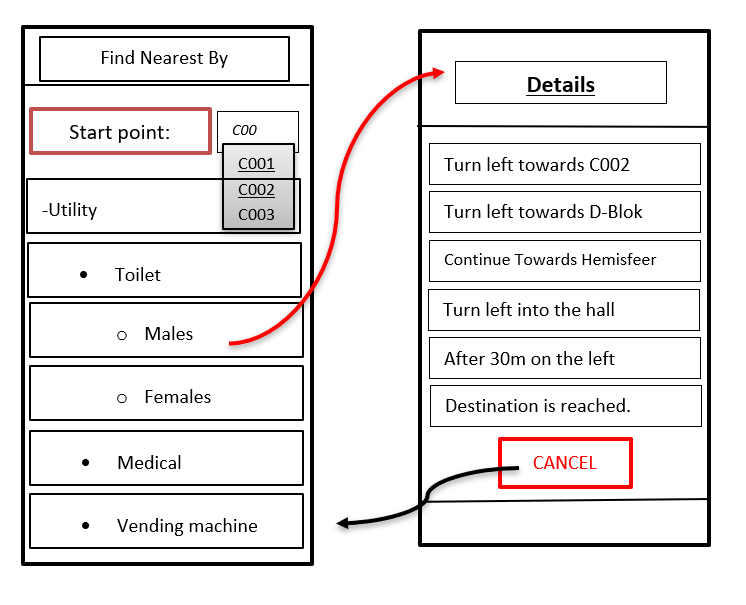

USER STORY B03. Utility-Based Navigation
----------------------------------------
As a *user*

I *want* to select my location in order to find a nearest by Utility

so that I can see the text-based navigation detail page.

ACCEPTANCE CRITERIA:
~~~~~~~~~~~~~~~~~~~~

Scenario 1:
^^^^^^^^^^^
*Given* a user +
*When* user types the code-name of classroom that user is at the moment
in _'Start point'_ +
*Then* a selectable list of locations based on input value will be shown.

Scenario 2:
^^^^^^^^^^^
*Given* a user +
*When* the user selects the Utility +
*Then* the applications returns the text-based navigation
detail page for the nearest by chosen Utility.

Scenario 3:
^^^^^^^^^^^
*Given* a user +
*When* the user clicks on _'Cancel'_ button on details page +
*Then* the applications returns back to Find Nearest by page.

WIREFRAMES:
~~~~~~~~~~~
  

TECHNICAL DETAILS:
~~~~~~~~~~~~~~~~~~
- Make a nested and logical list of utilities for selection.
- Make sure that after clicking 'Cancel' the value of the input for start point will remain the same in the 'Find Nearest by' page.
