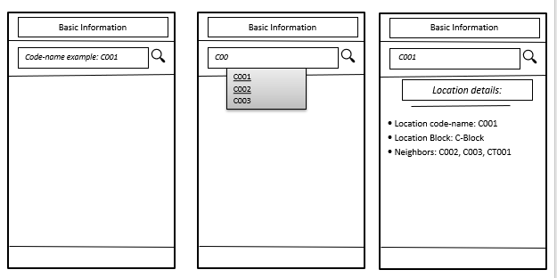

USER STORY B04. Basic Information about location
-------------------------------------------------
As a *user*

I *want* to select a location

so that I *can see* a basic Information about that particular locations.

ACCEPTANCE CRITERIA:
~~~~~~~~~~~~~~~~~~~~

Scenario 1: Relatable list of code-names shown as list.
^^^^^^^^^^^^^^^^^^^^^^^^^^^^^^^^^^^^^^^^^^^^^^^^^^^^^^^
*Given* a user +
*When* the user types the code-name of location +
*Then* a selectable list of locations based on input value will be shown.

Scenario 2: Details of the locations is shown.
^^^^^^^^^^^^^^^^^^^^^^^^^^^^^^^^^^^^^^^^^^^^^^
*Given* a user +
*When* the user selects the location code-name +
*Then* the applications returns the basic details on the detail section of the page.

Scenario 3: Invalid code-names returns error.
^^^^^^^^^^^^^^^^^^^^^^^^^^^^^^^^^^^^^^^^^^^^^
*Given* a user +
*When* the user enters invalid code-name  +
*Then* the applications returns 'No location found by this code-name'.

WIREFRAMES:
~~~~~~~~~~~

TECHNICAL DETAILS:
~~~~~~~~~~~~~~~~~~

- Follow User Story B01 for location's code-name input recommendation list.
- Use Event Listeners for displaying the details of the selected location.
* Working of event Listeners with https://www.w3schools.com/js/tryit.asp?filename=tryjs_addeventlistener_parameters[JavaScript^]
