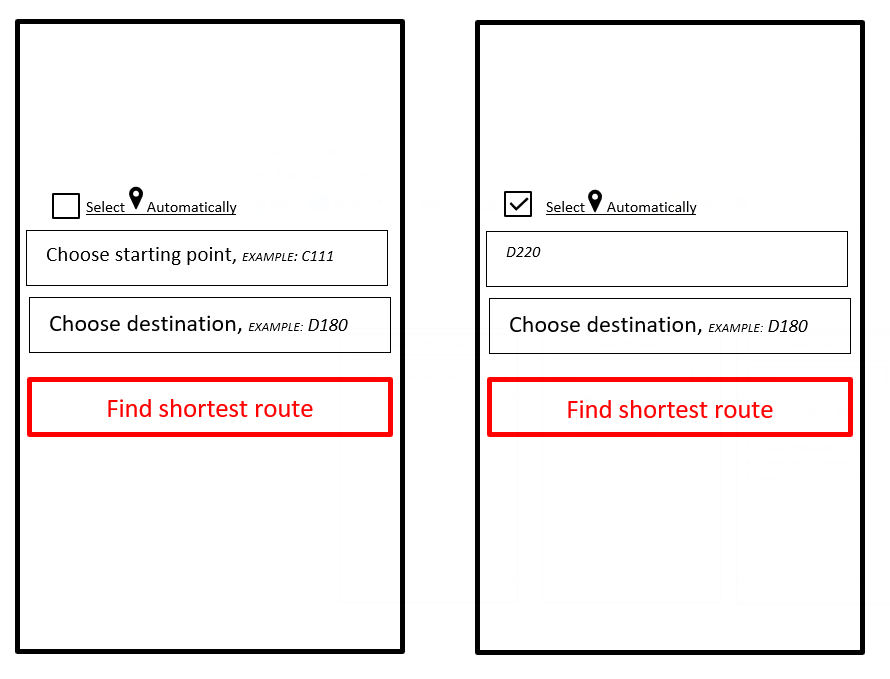

USER STORY B05. Automate starting point
---------------------------------------
As a *user*

I *want* to select my starting location automatically

so that I *can navigate* between the points.

ACCEPTANCE CRITERIA:
~~~~~~~~~~~~~~~~~~~~

Scenario 1: Checkbox enabled sets my location automatically
^^^^^^^^^^^^^^^^^^^^^^^^^^^^^^^^^^^^^^^^^^^^^^^^^^^^^^^^^^^^
*Given* a user +
*When* the user checks the checkbox 'Automate Location' +
*Then* the input value becomes the current location of the person.

Scenario 2: Disabled GPS on device *puts checkbox out of action* and gives an error message.
^^^^^^^^^^^^^^^^^^^^^^^^^^^^^^^^^^^^^^^^^^^^^^^^^^^^^^^^^^^^^^^^^^^^^^^^^^^^^^^^^^^^^^^^^^^^
*Given* a user +
*When* the user's GPS is not available +
*Then* the checkbox is disabled and a message is shown 'Allow the application to use your location information.'.

WIREFRAMES:
~~~~~~~~~~~

TECHNICAL DETAILS:
~~~~~~~~~~~~~~~~~~
* Options to automate user location:
. WI-FI location: ranging with RTT https://developer.android.com/things/sdk/drivers/location[Android Developers^]
. Android Location user drivers allow the app to publish updates to the device's physical location through the https://developer.android.com/things/sdk/drivers/location[Android locations Services.^]
