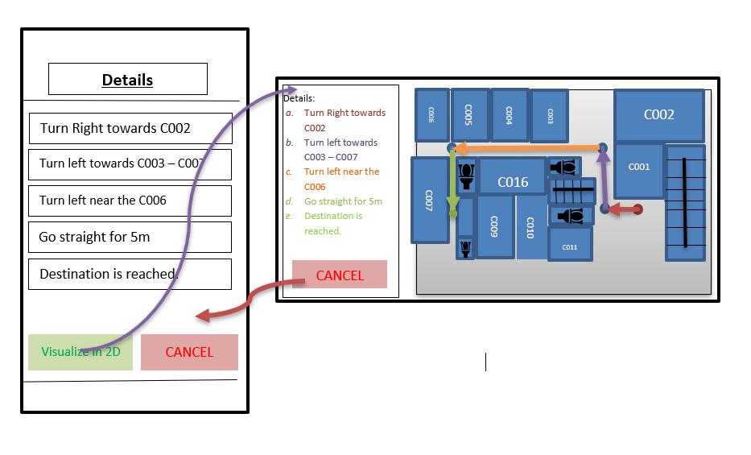

USER STORY B06. Select Visual Navigation
-----------------------------------------
As a *user*

I *want* to select Visual navigation type

so that I *can show the route* between the points in a basic 2-Dimensional map.

ACCEPTANCE CRITERIA:
~~~~~~~~~~~~~~~~~~~~

Scenario 1: Visualize in 2D map.
^^^^^^^^^^^^^^^^^^^^^^^^^^^^^^^^
*Given* a user +
*When* the user clicks on _'Visualize in 2D'_ button +
*Then* a 2D map of the route is shown on the 2D map page.

Scenario 2:Canceling the navigation details page.
^^^^^^^^^^^^^^^^^^^^^^^^^^^^^^^^^^^^^^^^^^^^^^^^^^
*Given* a user +
*When* the user clicks on _'Cancel'_ button on 2D map page +
*Then* the applications returns to previous page.

WIREFRAMES:
~~~~~~~~~~~

TECHNICAL DETAILS:
~~~~~~~~~~~~~~~~~~
