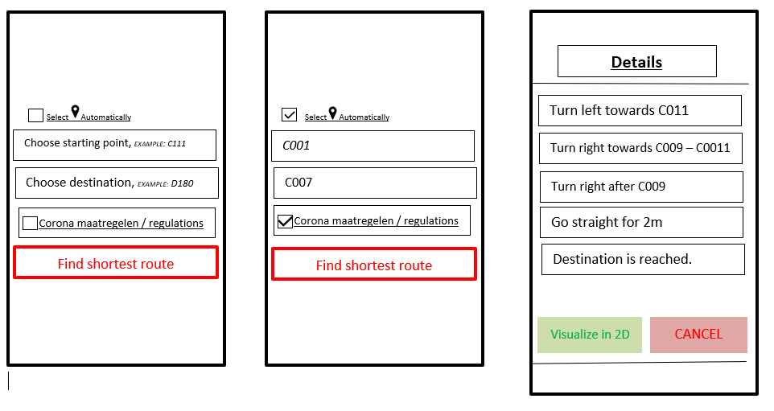

USER STORY B07. Corona Proof Navigation
---------------------------------------
As a *user*

I *want* to select Visual navigation type

so that I *can show the route* between the points based on Covid-19 regulations.

ACCEPTANCE CRITERIA:
~~~~~~~~~~~~~~~~~~~~

Scenario 1: Checkbox enabled sets Covid-19 regulations up
^^^^^^^^^^^^^^^^^^^^^^^^^^^^^^^^^^^^^^^^^^^^^^^^^^^^^^^^^^
*Given* a user +
*When* the user checks the checkbox 'Covid-19 regulations' +
*Then* the application return a list of steps based on Corona regulations, on details page.

WIREFRAMES:
~~~~~~~~~~~

TECHNICAL DETAILS:
~~~~~~~~~~~~~~~~~~
- Use a directed graph for setting the paths between the nodes.
