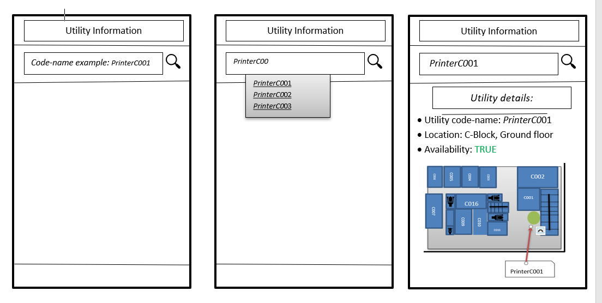

USER STORY B08. Utility Information
-----------------------------------
As a *user*

I *want* to select a Utility

so that I *can see* a basic Information about that particular Utility.

ACCEPTANCE CRITERIA:
~~~~~~~~~~~~~~~~~~~~

Scenario 1: Relatable list of code-names shown as list.
^^^^^^^^^^^^^^^^^^^^^^^^^^^^^^^^^^^^^^^^^^^^^^^^^^^^^^^
*Given* a user +
*When* the user types the code-name of Utility +
*Then* a selectable list of utilities based on input value will be shown.

Scenario 2: Details of the Utility is shown.
^^^^^^^^^^^^^^^^^^^^^^^^^^^^^^^^^^^^^^^^^^^^
*Given* a user +
*When* the user selects the utility code-name +
*Then* the applications returns the basic details on the detail section of the page.

Scenario 3: Invalid code-names returns error.
^^^^^^^^^^^^^^^^^^^^^^^^^^^^^^^^^^^^^^^^^^^^^
*Given* a user +
*When* the user enters invalid code-name  +
*Then* the applications returns 'No Utility found by this code-name'.

WIREFRAMES:
~~~~~~~~~~~

TECHNICAL DETAILS:
~~~~~~~~~~~~~~~~~~
- Use Event Listeners for displaying the details of the selected utility.
