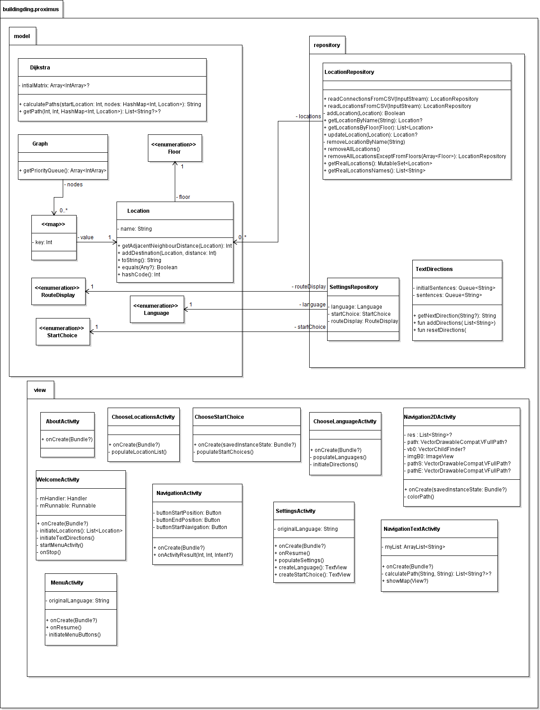

:toc: macro
:toclevels: 2
:icons: font
:doctype: article
:imagesdir: ./img
:nofooter:

image::ucll_pink.png[role="left",200,200]
{nbsp} +
{nbsp} +
{nbsp} +
[.text-center]
AFSTUDEERPROJECT TOEGEPASTE INFORMATICA +
Schooljaar 2020-2021

{nbsp} +
{nbsp} +
{nbsp} +
{nbsp} +
{nbsp} +

image::bdd_logo.png[400,400,float="center",align="center"]

{nbsp} +
{nbsp} +
{nbsp} +
{nbsp} +
{nbsp} +
{nbsp} +
{nbsp} +
{nbsp} +
{nbsp} +
{nbsp} +

[.text-right]
*_Auteurs:_* +
Hamid Khodayari +
Thomas Nelen +
Johan Molenberghs +
Jaron Trossaert

{nbsp} +
{nbsp} +

[.text-right]
*_Promotor:_* +
Frédéric Vogels

<<<

toc::[]

== 1. Scope and vision

=== 1.1. Business Requirements

==== 1.1.1. Background
Students and personnel at UCLL Proximus do not always know their way around the campus.
Especially first-timers such as new teachers and first year students often have to ask around on-site to know where they should go for their next class, or they might not even know how to get back to their car in the parking lot.
Of lesser importance are - amongst others - the cafeteria and the public restrooms, but even those places of interest are usually not easily found. +
Furthermore, some lost sheep sometimes don’t even know where they themselves are - for example when leaving a very confusing course, Databases 2 for example.
Being in such a state of disorientation can be quite a negative experience for anyone, quite possibly ruining the rest of the day. +
But it’s not only people who attend or teach classes that might need some guidance getting somewhere on campus.
Regularly, visitors not directly affiliated with the UCLL such as guest lecturers have to be somewhere on campus as well.
Delays due to high traffic around the campus notwithstanding, nobody’s happy when a guest arrives fabulously late for a specific appointment within the halls of campus Proximus, which sadly enough happens a lot. +
The problem of not finding the way around campus efficiently, or at all, is an issue that also pertains to locating certain objects like printers, emergency kits, cleaning utilities for the cleaning crew, and so on.
Finally, let us not forget about the emergency services.
It’s very important for them to not get lost on the way to an accident on the premises, or even on their way back to the ambulance.
This does not happen too often, but these kinds of dumb mishaps should be avoided at all costs when lives are on the line.

==== 1.1.2. Business Opportunity
Many persons have requested a system that would permit one to better navigate their way around the campus, or to be guided to the utilities, like the nearest printer or water fountain.
Such a system would save students and employees time as well as increase the chance of getting to their destinations in time.
Knowing the shortest route to their destination would reduce the time lost waiting for a lecturer or guest speaker and decrease the odds of classes getting disturbed by wayward students.

==== 1.1.3. Business Improvement Objectives
* BO-1: Reduce the arrival latency in freshman classes within a month following initial release.
** Scale: The duration freshmen spend finding an accurate path.
** Meter: Location of devices according to access points.
** Past: Approximately 15 minutes.
** Goal: Less than 10 minutes.

* BO-2: Reduce the amount of people in crowded areas.

* BO-3: Reduce the disruptions while classes are taking place.

* BO-4: Increase the course efficiency and students’ concentration during class.

==== 1.1.4. Success Metrics
* SM-1: 12% of campus first-timers and first year students use the app to find their way around.

* SM-2: Campus regulars who use the app find shorter routes than the ones known to them.

* SM-3: Utilities like printers and first aid kits are more easily found.

==== 1.1.5. Vision Statement
For people at UCLL Campus Proximus who want to find the shortest path to their destination on campus, Buildingding is an Android application that will guide its users along that path.
The application will save time and effort for the user by not needing to visit the reception, nor asking someone for directions, as well as not having to return from wrong paths.
Additionally, correct app usage reduces interaction with the receptionists for related questions, giving these employees more time for tasks with a higher priority.

==== 1.1.6. Business Risks
* RI-1: Too few students, staff and guests might use the application, making the time and effort put into the project appear as a waste of time. (Probability = 0.6, Impact = 3)

* RI-2: The application might give incorrect info about or wrong directions to a specific location, which would result in the user being worse off than before consulting the app. Additionally, this experience would reduce user satisfaction with the app and possibly their usage of it. (Probability = 0.3, Impact = 9)

* RI-3: The navigational aspect of the app might become outdated, for example when certain hallways become unavailable - either temporarily or permanently - to travel through, which means that the app users would not always be able to adhere to the suggested route. (Probability = 0.4, Impact = 7)

* RI-4: The access points, used for identifying locations within the app, might get modified over time. This would result in the app not performing to its full potential, or it might even make the app unusable if the app is improperly maintained post-release. (Probability = 0.2, Impact = 8)

=== 1.2. Scope and Limitations

==== 1.2.1. Major Features
* FE-1: Receive the shortest route to a designated spot on campus.

* FE-2: Find your current location on the premises.

* FE-3: View basic information for a specified location within the building complex.

==== 1.2.2. Stakeholders profiles
[options="header"]
|=======================
|Stakeholder|Major Value|Attitudes|Major Interests|Constraints
|First-year students, trainees, guests, new lecturers|Reduced stress when looking for a classroom.|Strong enthusiasm, can traverse through the campus more easily.|Simplicity of use; time and effort savings to find specific locations on campus.|Parties should be made aware of the existence of the application beforehand.
|Reception staff|Less frequently distracted from work to give directions.|Concern about not being aware of guests currently on campus; otherwise receptive.|Reducing the total workload with minimal changes to payroll.|Communication with third parties to create application awareness.
|Attendees on campus|In case of emergency, quickly find the nearest exit.|Strong commitment through release 2; may not be used frequently.|Simplicity of use; extra means of safety when traversing campus grounds.|Need to have application installed and mobile device nearby when an emergency arises.
|Students|Find infrequently used locations more easily.|Receptive through release 1; may not use application frequently.|Minimal effort needed; become more knowledgeable of campus features and their respective locations.|Need to have application installed and device within reach.
|Application maintenance team|No benefit; needs to maintain the application to ensure routes are up to date in case of unconventional situations.|Not happy about the obligatory software work; recognize the value to the organization and its users.|Minimal new technology needed; concern about difficulty of editing and updating the application.|Might not have the staff or knowhow necessary to make changes to the application.
|=======================

=== 1.3. Software Requirements Specifications

==== 1.3.1. Users and Characteristics
.Guidee
The guidee is any user who wants to find a specified location on campus.
There are on average one thousand people present on campus, of which 50 or more would be expected to use the application simultaneously.

==== 1.3.2. Operating Environment Constraints
* OE-1: The app only works on mobile devices running Android 9 and later.

* OE-2: Because the app uses Kotlin, the backend is cross-platform.

==== 1.3.3. Design and Implementation Constraints
* CO-1: The system’s design, code, and maintenance documentation shall conform to the UCLL Intranet Development Standard.

* CO-2: The system shall use Kotlin as the main programming language.

* CO-3: The app utilizes the Wi-Fi Round Trip Time Android standard to help localize the user with Time of Flight ranging capabilities.

==== 1.3.4. Assumptions
* The operation of the app depends on the usage consistency of the current Cisco access points which broadcast their BSSID.

* Buildingding and its creators assume that the campus premises are available to its user while consulting the app.
It does not account for temporary closures such as during holiday periods and lockdowns.

* Location on the mobile device is enabled.

* The app will be distributed as an .apk file through a private link. Therefore, application installations coming from sources unknown to the Android system must be allowed on the related device.

* The app only works on the premises of Campus Proximus.

=== 1.4. External Interface Requirements

==== 1.4.1. User Interfaces
* UI-1: The Buildingding app screens shall conform to the corporate design of the UCLLfootnote:[https://intranet.ucll.be/nl/student/studeren-aan-ucll/pba-de-toegepaste-informatica-proximus/opleiding/kleuren-en-lettertypes-ucll].

* UI-2: The app shall provide multiple languages for each displayed page in order to provide support for international students.

* UI-3: The application pages shall permit complete navigation using single hand gestures alone, in addition to optionally using the phone camera.

* UI-4: Buildingding can be used in both portrait and landscape mode, but is primarily designed to use in portrait mode.

* UI-5: Additional accessibility options such as a colour-blind mode are not supported as of yet, but it will be looked into in the near future if there is a demand for it.

==== 1.4.2. Software Interfaces
* SI-1: Localisation System
** SI-1.1: Buildingding shall transmit the whereabouts of the user to the Localisation System through a programmatic interface.
** SI-1.2: The app shall poll the Localisation System either through a location list or through scanning for the user's whereabouts.
** SI-1.3: The scanning utility within the Localisation System only supports certain scannable entities, i.e. very specific QR codes.

* SI-2: Navigational System +
Buildingding shall communicate with the Navigational System through a programmatic interface for the following operations:
** SI-2.1:  To allow a Guidee to enter his/her destination address.
** SI-2.2: To calculate the optimal route for the Guidee to follow from his/her start location to his/her destination.
** SI-2.3: To allow the Guidee to see his/her optimal path as a list of instructions.
** SI-2.4: To show the optimal path on a two-dimensional visualisation, i.e. show the route on a map.
** SI-2-4: To back out of the calculated route in order for the Guidee to enter new start and/or end positions.

==== 1.4.3. Communications Interfaces
* CI-1: The Buildingding app does not notify the Guidee as of yet when he/she has arrived at the chosen destination, but it will be looked into in the near future if there is a demand for it.

== 2. Planning

=== 2.1. Kanban
Jira software was used to monitor and support the Buildingding project. The roadmap, backlog, and board features of this agile project management tool were invaluable during the development of the app.

.In-progress epics on the kanban board
image::kanban_prep.png[float="center",align="center"]

.A snapshot of the backlog
image::kanban_backlog.png[float="center",align="center"]

=== 2.2. User story map
image::story_map_v2.png[float="center",align="center"]

=== 2.3. User story priority list
[options="header"]
|=======================
|Must have
|Show list of start locations
|Show list of end locations
|Find optimal path to destination
|Show path in text format
|Designate starting position
|Designate finish position
|Start navigation
|=======================

[options="header"]
|=======================
|Should have
|Basic location info
|2D visual navigation
|End navigation
|Change destination
|Corona based directions
|Automated localisation
|=======================

[options="header"]
|=======================
|Nice to have
|Compass-based map rotation
|Restroom hotkey
|AR text-based directions
|"Point me to the nearest free classroom"
|Schedule integration
|Find people on campus
|Text-to-speech based directions
|Alternative starting position
|Multi-language support
|Voice assist
|Time tracking
|Time estimates
|Find location by room name
|Update current location
|Find optimised path to destination with constraints
|AR arrow-based directions
|Colour-blind support
|=======================

== 3. User stories

=== 3.1. User story B01: Localisation
As a *user*

I *want* to select locations from input list

so that I *can navigate* between the points.

==== 3.1.1. Acceptance criteria
*Scenario 1:  Valid starting point and destination point list* +
*Given* a user +
*When* user types the code-name of classroom as _'Choose starting point'_
or code-name of destination in _'Choose destination'._ +
*Then* a selectable list of locations based on input value will be shown.

==== 3.1.2. Wireframes
image::usb01_wireframe.png[alt="User Story 1 Wireframe."]

==== 3.1.3. Technical details
- Use this topic to make the input autocomplete option: https://www.geeksforgeeks.org/autocompletetextview-in-kotlin/[AutoCompleteTextView in Kotlin
^]

=== 3.2. User story B02: Text-based Navigation
As a *user*

I *want* to go to details page

so that I *can see* a text-based navigation between two points.

==== 3.2.1. Acceptance criteria
*Scenario 1: Find the shortest route between points* +
*Given* a user +
*When* the user clicks on _'Find shortest Route'_ button +
*Then* a list of steps to be taken to reach destination will be shown.

*Scenario 2: Cancelling the navigation details page* +
*Given* a user +
*When* the user clicks on _'Cancel'_ button on details page +
*Then* the application returns to previous page.

==== 3.2.2. Wireframes
image::usb02_wireframe.png[alt="User Story 2 Wireframe."]

==== 3.2.3. Technical details
- https://www.geeksforgeeks.org/check-possible-move-given-coordinate-desired-coordinate/?ref=lbp[Check if possible to move from given coordinate to desired coordinate^]
 (Java)
- This example will help you understand the Vector implementation on a Java application: https://noobtuts.com/java/vector2-class[vector2 Class^]
- To know the directions of the path such as, left, right or straight.
You can use https://www.intmath.com/vectors/3-vectors-2-dimensions.php[Vectors in 2-D^]
* Giving the location coordination parameters (x, y)
* Using magnitude and direction of a 2-dimensional Vector
. Clockwise direction of the angle: right
. Counterclockwise direction of the angle: left
* A vector showing the position of a point A with coordinates (2, 3) and a point O with coordinates (0,0)

image::vector.png[alt="A vector in the Cartesian plane, showing the position of a point A with coordinates (2, 3).", width=200]

=== 3.3. User story B03: Utility-based Navigation
As a *user*

I *want* to select my location in order to find a nearest by Utility

so that I *can see* the text-based navigation detail page.

==== 3.3.1. Acceptance criteria
*Scenario 1: Relatable list of code-names shown as list* +
*Given* a user +
*When* user types the code-name of classroom that user is at the moment
in _'Start point'_ +
*Then* a selectable list of locations based on input value will be shown.

*Scenario 2: Utility selection from the list* +
*Given* a user +
*When* the user selects the Utility +
*Then* the application returns the text-based navigation
detail page for the nearest by chosen Utility.

*Scenario 3: Canceling the navigation details page* +
*Given* a user +
*When* the user clicks on _'Cancel'_ button on details page +
*Then* the application returns back to Find Nearest by page.

==== 3.3.2. Wireframes
image:usb03_wireframe.png[alt="User Story 3 Wireframe."]

==== 3.3.3. Technical details
- Follow User Story B01 for start point input recommendation list.
- Follow User Story B02 for Nearest By Utility, Text-Based Detail page.
- Make a nested and logical list of utilities for selection.
- Make sure that after clicking 'Cancel' the value of the input for start point will remain the same in the 'Find Nearest by' page.

=== 3.4. User story B04: Basic Information about Location
As a *user*

I *want* to select a location

so that I *can see* basic Information about that particular location.

==== 3.4.1. Acceptance criteria
*Scenario 1: Relatable list of code-names shown as list* +
*Given* a user +
*When* the user types the code-name of location +
*Then* a selectable list of locations based on input value will be shown.

*Scenario 2: Details of the locations is shown* +
*Given* a user +
*When* the user selects the location code-name +
*Then* the application returns the basic details on the detail section of the page.

*Scenario 3: Invalid code-names returns error* +
*Given* a user +
*When* the user enters invalid code-name  +
*Then* the application returns 'No location found by this code-name'.

==== 3.4.2. Wireframes
image:usb04_wireframe.png[alt="User Story 4 Wireframe."]

==== 3.4.3. Technical details
- Follow User Story B01 for location's code-name input recommendation list.
- Use Event Listeners for displaying the details of the selected location.
* Working of event Listeners with https://www.w3schools.com/js/tryit.asp?filename=tryjs_addeventlistener_parameters[JavaScript^]

=== 3.5. User story B05: Automate Starting Point
As a *user*

I *want* to select my starting location automatically

so that I *can navigate* between the points.

==== 3.5.1. Acceptance criteria
*Scenario 1: Checkbox enabled sets my location automatically* +
*Given* a user +
*When* the user checks the checkbox 'Automate Location' +
*Then* the input value becomes the current location of the person.

*Scenario 2: Disabled GPS on device puts checkbox out of action and gives an error message* +
*Given* a user +
*When* the user's GPS is not available +
*Then* the checkbox is disabled and a message is shown 'Allow the application to use your location information.'.

==== 3.5.2. Wireframes
image:usb05_wireframe.png[alt="User Story 5 Wireframe."]

==== 3.5.3. Technical details
* Options to automate user location:
. WI-FI location: ranging with RTT https://developer.android.com/things/sdk/drivers/location[Android Developers^]
. Android Location user drivers allow the app to publish updates to the device's physical location through the https://developer.android.com/things/sdk/drivers/location[Android locations Services.^]

=== 3.6. User story B06: Select Visual Navigation
As a *user*

I *want* to select Visual navigation type

so that I *can show the route* between the points in a basic 2-Dimensional map.

==== 3.6.1. Acceptance criteria
*Scenario 1: Visualize in 2D map* +
*Given* a user +
*When* the user clicks the _'Visualize in 2D'_ button +
*Then* a 2D map of the route is shown on the 2D map page.

*Scenario 2: Cancelling the navigation details page* +
*Given* a user +
*When* the user clicks the _'Cancel'_ button on 2D map page +
*Then* the application returns to the previous page.

==== 3.6.2. Wireframes
image:usb06_wireframe.png[alt="User Story 6 Wireframe."]

=== 3.7. User story B07: Corona Proof Navigation
As a *user*

I *want* to select the Covid-19 regulations Checkbox

so that I *can show the route* between the points based on Covid-19 regulations.

==== 3.7.1. Acceptance criteria
*Scenario 1: Checkbox enabled navigation via Covid-19 regulations based pathway* +
*Given* a user +
*When* the user checks the checkbox 'Covid-19 regulations' +
*Then* the application return a list of steps based on Corona regulations, on details page.

==== 3.7.2. Wireframes
image:usb07_wireframe.png[alt="User Story 7 Wireframe."]

==== 3.7.3. Technical details
- Use a directed graph for setting the paths between the nodes.

=== 3.8. User story B08: Utility Information
As a *user*

I *want* to select a Utility

so that I *can see* the basic Information about that particular Utility.

==== 3.8.1. Acceptance criteria
*Scenario 1: Relatable list of code-names shown as list* +
*Given* a user +
*When* the user types the code-name of Utility +
*Then* a selectable list of utilities based on input value will be shown.

*Scenario 2: Details of the Utility is shown* +
*Given* a user +
*When* the user selects the utility code-name +
*Then* the application returns the basic details on the detail section of the page.

*Scenario 3: Invalid code-names returns error* +
*Given* a user +
*When* the user enters invalid code-name  +
*Then* the application returns 'No Utility found by this code-name'.

==== 3.8.2. Wireframes
image:usb08_wireframe.png[alt="User Story 8 Wireframe."]

==== 3.8.3. Technical details
- Use Event Listeners for displaying the details of the selected utility.

== 4. UML Domain class diagram

== 5. Promotor meetings

=== 5.1. Intro meeting 21/09
---------------------------------------------------------

DATUM: 21/09/2020
AANWEZIGEN: HAMID, THOMAS, JOHAN, JARON
VERONTSCHULDIGD:
VERSLAGGEVER: Thomas
DATUM VOLGENDE VERSLAG: /
AGENDA: INLEIDING, VERWACHTINGEN PROJECT, TECHNICAL DETAILS, CHALLENGES
---------------------------------------------------------
==== 5.1.1. Kort verslag
- Verwachtingen van het project: Er is veel vrijheid in de ontwikkeling van de applicatie. Enerzijds gaat het om onderzoek naar mogelijke technologieeën en hun bruikbaarheid bij het maken van een navigatieapplicatie. Dit onderzoek moet zoveel mogelijk omgezet worden naar een effectieve applicatie om de weg in Campus proximus te vinden. Wekelijks vergaderen om resultaten te bespreken, net zoals de verwachtingen en plannen van de week daarop.
- Technical details: Hele team heeft een android toestel. De development van het project zal daarom in Android Studio gebeuren met Kotlin. Er is een git-repo om de vooruitgang in op te slaan. Jira wordt gebruikt als kanbanbord.
- Challenges: Augmented reality gebruiken om de weg naar de gewenste bestemming weer te geven. Een "neural network" opstellen en Access Points gebruiken om de huidige locatie van een gebruiker te gebruiken. Een 2D plattegrond van de school, met de locatie van de gebruiker en een richtingsaanwijzing voor de bestemming.

=== 5.2. Meeting 24/09
---------------------------------------------------------

DATUM: 24/09/2020
AANWEZIGEN: HAMID, THOMAS, JOHAN, JARON
VERONTSCHULDIGD:
VERSLAGGEVER: HAMID
DATUM VOLGENDE VERSLAG: 28/09/2020
AGENDA: BASIS DOCUMENTATIE, UML MVP, USER STORY MAPPING, USER STORIES & LOGICAL DATA STRUCTURE
---------------------------------------------------------
==== 5.2.1. Kort verslag
- Gesproken over de vooruitgang van het afstudeerproject, agenda punten en de manier waarop we het project gaan aanpakken.
- Per node bijhouden: Directive Graphs
- Advies gekregen over het modeleren van richtingen voor 2-dimensionale coördinaten.
* Per node een vector bijhouden met punten (x, y) om positie van de node op een assenstelsel te bepalen. Zodat het bepalen van richting (bv. links, rechts Of rechtdoor) wiskundig opgelost kan worden.
- De documentatie van het project wordt in het Engels geschreven.

==== 5.2.2. Acties
- Een kort onderzoek doen voor het implementeren van vector.
- Onderzoek: Directive Graphs en hoe het in onze project past.
- Documentatie van het project in het Engels schrijven.

=== 5.3. Meeting 28/09
---------------------------------------------------------

DATUM: 28/09/2020
AANWEZIGEN: JOHAN, JARON, THOMAS, HAMID
VERONTSCHULDIGD:
VERSLAGGEVER: JOHAN, THOMAS
DATUM VOLGENDE VERSLAG: 12/10/2020
AGENDA: Planning, manier van werken, Testing
---------------------------------------------------------
==== 5.3.1. Kort verslag
- Demonstreren van project UML
- Bijhouden van data binnen de applicatie
- Bespreking uitwerking algoritme
- Waterfall manier van werken bespreken

==== 5.3.2. Acties
- UML vereenvoudigen, er zijn een heel aantal klassen die overbodig zijn
- Test-driven en modulair werken in plaats van zoveel mogelijk op voorhand te designen
- Kleine app maken om te beginnen, en daarna uitbreidingen maken
- Bidirectioneel tussen twee locaties opsplitsten in 2 directed pijlen, de ene naar de ene kant en de andere omgekeerd
- Databank aanmaken voor de lokalen in een apart bestand en dan inlezen, zodat het programma niet moet recompilen als locaties gewijzigd worden. Excel of SQL?
- verschillende modules maken (pathfinding, visualisatie), goed denken wat die nodig hebben en daarna samenvoegen

=== 5.4. Meeting 12/10
---------------------------------------------------------

DATUM: 12/10/2020
AANWEZIGEN: THOMAS, HAMID
VERONTSCHULDIGD: JOHAN, JARON
VERSLAGGEVER: HAMID
DATUM VOLGENDE VERSLAG: 14/10/2020
AGENDA: Technisch review and details
---------------------------------------------------------
==== 5.4.1. Kort verslag
- Dijkstra: de obstakels en trage werking
- Algorithm: A* en de mogelijkheden voor onze app
- 2-D Navigatie: PNGs geven problemen voor het weergeven van routes

==== 5.4.2. Acties
- Dijkstra: Minder gebruik maken van for loops.
* Functioneel programmeren
* Gebruik een controle of een node al bezocht is
* Verwijder de printMatrix() method - vertraging reden voor dijkstra.
- 2-D Navigatie: Voor android toestellen best vector drawables gebruiken
* Je moet een xml bestand hebben i.p.v. meerdere pngs te genereren.
* Beeld kwaliteit is beter, minder opslagruimte nemend, kan animaties toegevoegd worden.

=== 5.5. Meeting 14/10
---------------------------------------------------------

DATUM: 14/10/2020
AANWEZIGEN: JOHAN, JARON, THOMAS, HAMID
VERONTSCHULDIGD:
VERSLAGGEVER: HAMID
DATUM VOLGENDE VERSLAG: NA
AGENDA: Demo Applicatie, Kleine aanpassingen & voorbreiding afstudeerproject presentatie
---------------------------------------------------------
==== 5.5.1. Kort verslag
- Demonstreren van de BuildingDing App
- Instellingen features: Taal veranderen naar Frans, Engels en Nederlands
- Text based navigatie: Een mooie oplijsting van route beschrijving
- 2-D Navigatie: volgens de circulatie plan

==== 5.5.2. Acties
- Instellingen:
* De talen worden niet veranderd in hele applicatie na de 'terug gaan' knop te druken.
* Keuze voor navigatie type verwijderen en een mogelijkheid in text based view vinden.
- Text based Navigatie: best dat in deze pagina een verwijzing is naar 2-D navigatie.
- 2-D Navigatie: Werk proof of concept, dus alleen kunnen Demonstreren bv. alleen b0 block.
- Afstudeerproject presentatie: maak het niet te technisch, alleen: problemen en de invloed daarvan, communicatie tussen teamleden, onderzoeken enz.

== 6. Manuals

=== 6.1. Technical manual

==== 6.1.1. Introduction
Buildingding is a Proof of Concept application made for Campus Proximus to help people navigate through the campus. The application is not yet available on the Play Store.

==== 6.1.2. Git and GitHub
First of all we need to get the Buildingding application on our local device. To do this we need to install Git. We can install git by first navigating to this url https://git-scm.com/downloads, and downloading the correct installer. Next run the installer, follow the steps and Git will be present in your system.

image::git.png[500, 500]

After these steps are completed, open a GitBash terminal and type the following command. It will fetch the application from a remote repository and store it locally.

----
git clone https://github.com/UCLeuvenLimburg/Buildingding.git
----

==== 6.1.3. Android Studio
Now that we have our application on our device, we still need an emulator for a mobile device and a way to run it. Luckily for us Android Studio can serve as both. Go to the website of Android Studio (https://developer.android.com/studio), download and install the program.

image::android_studio.png[500, 500]

The next step is to open android studio, choose to open an existing project and locate the cloned repository to put this project in Android Studio.

image::android_studio_open_project.png[500, 500]

==== 6.1.4. Running the application
To run the project we need an emulator, which we can easily set-up in Android studio. Locate the AVD manager. Next choose create a new virtual device. Any device should work, but we recommend the Pixel 3a. After selecting a device click next, and choose the release "Q" with API level 29.

Now that we have done all these steps we can run the application by clicking the green triangle.

image::start.png[500, 500]

=== 6.2. User manual

==== 6.2.1. Buildingding: purpose

The purpose of Buildingding is to help the user navigate Campus Proximus. Which is especially helpful with the standing circulation planning due to the pandemic concerning 'COVID-19'. This application was written as a graduation project for UCLL Applied Informatics in 2020 by order of Dr. Vogels F.

The user can choose a starting location and destination by choosing from a list of available locations. Alternatively, the user could scan a QR-code present at the current location to set the starting location, but still has to choose the destination from a list.

Once the path has been calculated, the user can choose to see the path as a list of locations or as a 2D visualization on a map.

The application does not use real-time tracking.

This application is suited for Android 10 and higher.

The supported languages are:

* English
* Dutch
* French

==== 6.2.2. Installing Buildingding

To help you installing Buildingding, please refer to the installation manual.

==== 6.2.3. Starting Buildingding

You can start the application by tapping the Buildingding icon on your screen. (Layouts may differ on your device)

image:1_homescreen.png[width=100%, scalewidth=40cm]

If the icon is missing, you can search for Buildingding by

. Swiping 'up' on your main screen.
. Entering the term 'buildingding' in the searchbar
. Tapping the Buildingding icon

image:2_1_appscreen.png[width=100%, scalewidth=40cm] image:2_2_appscreen.png[width=100%, scalewidth=40cm] image:2_3_appscreen.png[width=100%, scalewidth=40cm]

You will then be shown a welcome screen for two seconds after which you will enter the main menu

image:3_1_splashscreen.png[width=100%, scalewidth=40cm] image:3_2_homescreen.png[width=100%, scalewidth=40cm]

==== 6.2.4. Navigation

To start the navigation you should tap the navigation button in the main menu. After which you will be shown the main navigation screen.

image:4_1_navigation_menu.png[width=100%, scalewidth=40cm] image:4_2_navigation_main.png[width=100%, scalewidth=40cm]

On this screen can start choosing locations, or go back to the main menu

<<<

===== 6.2.4.1. Choosing a starting location

To choose a start location you have to tap the button marked "START POSITION"

image:5_1_navigation_start_position.png[width=100%, scalewidth=40cm]

Depending on the applied setting, you will have to choose a starting location from a list, or scan a QR-code. Afterwards you can alter the choice by tapping the button again, which now holds your previous choice.

====== 6.2.4.1.1. Choosing a starting location from the list

If the setting "List" is applied, you will be shown a scrollable list of possible locations. When you tap on a location, you will be taken back to the main navigation screen.

image:5_2_start_location_list.png[width=100%, scalewidth=40cm] image:5_3_start_location_list_scrolled.png[width=100%, scalewidth=40cm] image:5_5_chosen_start.png[width=100%, scalewidth=40cm]

====== 6.2.4.1.2. Scanning a QR-code

If the setting "Scan" is applied, you will have to scan a QR-code, after which you will be taken back to the main navigation screen.

image:5_4_start_location_QR.png[width=100%, scalewidth=40cm] image:5_4_start_location_QR_scan.png[width=100%, scalewidth=40cm] image:5_5_chosen_start.png[width=100%, scalewidth=40cm]

===== 6.2.4.2. Choosing a destination

After choosing the start position, you should choose a destination by tapping the button marked "END POSITION". Doing so will show you a scrollable list of possible locations. When you tap on a location, you will be back on the main navigation screen, where you can change the locations, or start the navigation.

image:5_6_navigation_end_position.png[width=100%, scalewidth=40cm] image:5_8_choose_locationscreen.png[width=100%, scalewidth=40cm] image:5_9_choose_locationscreen_scroll.png[width=100%, scalewidth=40cm] image:5_7_chosen_end.png[width=100%, scalewidth=40cm]

===== 6.2.4.3. Starting the navigation

To start the navigation you should then tap the button marked "START"

image:5_8_start_navigation.png[width=100%, scalewidth=40cm]

After tapping this button you will see a scrollable list of locations, which you have to follow to reach your destination. If you tap a location in this list, you will be shown a map of the floor with the highlighted route. The starting location will be marked green and the destination will be red. If you tap this map, you will return to the list overview.

image:6_1_path as list.png[width=100%, scalewidth=40cm] image:6_2_path as list_scrolled.png[width=100%, scalewidth=40cm] image:6_7_2D_navigation.png[width=100%, scalewidth=40cm]
image:6_8_2D_navigation_tilted.png[]

<<<

==== 6.2.5. Changing the Settings

To change the settings you should tap the button marked "SETTINGS" on the main menu.
To reach the main menu, you can use the back button on your mobile device.
(image may differ on your device.) It could be possible you need to tap the back button multiple times.

image:7_change_settings.png[width=100%, scalewidth=40cm]image:back_button.png[width=100%, scalewidth=40cm]

When you tap on the "SETTINGS" button, you will be shown a list of possible settings.
 At the moment these are:

* Language: this will change the language used in Buildingding
* Start choice: this will change the way you can set the starting point.

To change the desired setting you can tap the correct button, otherwise you can cancel by tapping the back button (image may differ on your device.) When you have made a choice, you will be returned to the main menu.

image:9_1_settingsscreen.png[width=100%, scalewidth=40cm]image:back_button.png[width=100%, scalewidth=40cm]

<<<

===== 6.2.5.1. Changing the language

If you chose to change the language, you will be shown a list of the implemented languages. To choose a language, you can tap the button marked with the appropriate text. To cancel a change, you can utilize the back button (image may differ on your device.) At the moment the choices are:

* English
* Nederlands
* Francais

If one of these languages is the main language of your device, Buildingding will default to this language.
When you have made a choice, you will be returned to the main menu in the appropriate language.

image:9_2_languagescreen.png[width=100%, scalewidth=40cm] image:back_button.png[width=100%, scalewidth=40cm] image:3_2_homescreen.png[width=100%, scalewidth=40cm]

===== 6.2.5.2. Changing the start location input method

To change the input method, you should tap the corresponding button.
To cancel a change, you can utilize the back button (image may differ on your device.)
At the moment the choices are:

* Scan
* List (default)

When you have made a choice, you will be returned to the main menu.

image:9_3_startchoicescreen.png[width=100%, scalewidth=40cm]image:back_button.png[width=100%, scalewidth=40cm] image:3_2_homescreen.png[width=100%, scalewidth=40cm]

==== 6.2.6. About screen

The third option on the main menu will show you brief information about the application.
You can exit this using the back button.

image:8_about_menu.png[width=100%, scalewidth=40cm] image:10_aboutscreen.png[width=100%, scalewidth=40cm] image:back_button.png[width=100%, scalewidth=40cm]

== 7. Research docs

=== 7.1. Git research

==== 7.1.1. Git

*Git* is a an open source distributed version control system.

==== 7.1.2. Git Features

Git allows you to have multiple local branches, that can be entirely independent of each other. When pushing to the remote, you are not required to push all of your branches. Git is fast as most of the operations are performed locally. For this reason it has a speed advantage on centralized systems that constantly have to communicate with a server.

==== 7.1.3. Project implementation

For this project we will use four main branches. Master for fully ready releases to the public. Develop for the development of new modules to the project. Hotfix will be used to fix bugs on already created modules and lastly thesis for the documentation of the project.

==== 7.1.4. GitHub

*GitHub* is a platform that provides hosting for software development and version control using Git. it uses the functionality of Git, added with features of it's own.

===== 7.1.4.1. GitHub Features

====== 7.1.4.1.1. Issues

Issues are used to track todos, bugs, feature requests, and more. As issues are created, they’ll appear here in a searchable and filterable list. Issues support most image and file types for attachments.
https://github.com/UCLeuvenLimburg/Buildingding/issues 

====== 7.1.4.1.2. Pull Requests

Pull requests create the possibility to make potential changes to a branch or repository on GitHub. These potential changes can be reviewed with collaborators before they are merged into the base branch. 

====== 7.1.4.1.3. Actions

Build, test, and deploy your code. Make code reviews, branch management, and issue triaging work the way you want. Select a workflow template to get started.
https://github.com/UCLeuvenLimburg/Buildingding/actions/new

Actions can also be used to automate certain parts in the process, or execute certain behaviour when a trigger condition is met. 

====== 7.1.4.1.4. Wiki

The Wiki on GitHub help you present in-depth information about your project. These's wiki's can be written in any format supported by GitHub MarkUp. 

====== 7.1.4.1.5. Projects

Projects allow tasks to be coordinated, tracked and updated in once central place, namely GitHub. Issues can be used to implement new features or fix bugs. These can then be assigned to members of the teams. A project can give an overview very similar to a typical Kanban board.

==== 7.1.5. Sources

https://www.idalko.com/jira-github-integration/ 
https://nvie.com/posts/a-successful-git-branching-model/ 
https://www.atlassian.com/git/tutorials/using-branches
https://allenan.com/git-branch-naming-conventions/
https://guides.github.com/features/wikis/
https://github.com/features/project-management
https://docs.github.com/en/free-pro-team@latest/desktop/contributing-and-collaborating-using-github-desktop/creating-an-issue-or-pull-request
https://docs.github.com/en/free-pro-team@latest/github/collaborating-with-issues-and-pull-requests/about-pull-requests
https://en.wikipedia.org/wiki/GitHub
https://git-scm.com/

=== 7.2. Kotlin research

*Kotlin* is a cross-platform, statically typed, general-purpose programming language with type inference like Java, C++, which is based on JVM (Java Virtual Machine).

Kotlin is designed to interoperate with Java, and the JVM of Kotlin's standard library depends on the Java Class library.
Kotlin targets the JVM, but also compiles to JS such as frontend web applications using https://en.wikipedia.org/wiki/React_(web_framework)[React^], or Machine code via  https://en.wikipedia.org/wiki/LLVM[LLVM compiler infrastructure project ^], for example for native iOS apps sharing business logic with Android apps.

Switching from Java to Kotlin is very easy as we just need to install a plugin. On 7 May 2019, Google announced that they are making Kotlin an officially supported language for Android application development.footnote:[https://en.wikipedia.org/wiki/Kotlin_(programming_language)[Kotlin (programming language) - Wikipedia^]]

.Try Kotlin Playground
[NOTE]
===============================
*NOTE* Kotlin Playground is an online sandbox to explore the Kotlin programming language. Browse code samples directly in the browser.

Go to: https://play.kotlinlang.org/[Kotlin Playground^]
===============================

=== 7.3. Shortest path research
The basic goal is to determine the shortest path between a starting node, and the rest of the graph, which is a
theoretic problem known to graph.

==== 7.3.1. Dijkstra Shortest Path Algorithm

*Dijkstra* algorithm a.k.a. *SPF* algorithm (Shortest Path First) is an algorithm for finding the shortest path
between nodes in a graph. Which in our case represents the Campus Proximus indoor path network.
The core idea is to continuously wipe out the longer paths between the starting node and all possible destinations.

image::dijstra_graph_example.png[[alt="not bad.",width=500,height=400]

Given a positively weighted graph and a starting Node(C001), SPF determines the shortest path and distance from the source to all destinations in graph.

===== 7.3.1.1. Initialization

We need to initialize all nodes with an infinite number distance and an unknown predecessor,
except de start node. For Node 'C001' we assign the value 0.
All the nodes except 'C001' will be distinguished with a predecessor *'X'* and a distance *'∞'*.

image::dijstra_graph_init.png[[alt="Dijkstra initialization process.", width=500]

.Initialization Notes.
[NOTE]
===============================
. The distance from node C001 to C001 is 0.
===============================

===== 7.3.1.2. Evaluation

After initializing the graph, pick the node with the lowest distance value, then we
evaluate all neighboring nodes:

image::dijstra_graph_evaluation.png[alt="Dijkstra Evaluation process.", width=500]

Add the edge weight to the evaluation node distance, then compare it to the destination's distance. +
*Example:* For node 'C002': 0 + 10 < ∞ , so the new distance for 'C002' is 10 and new predecessor is 'C001'

image::dijstra_graph_evaluation01.png[alt="Dijkstra Evaluation process.", width=500]

- Node 'C001' is moved from unsettled set to settled set.
- Nodes 'C002' and 'C003' are added to the unsettled set. They can be reached, but they need to be evaluated.
- We have now two nodes in unsettled set, we take the one with the lowest distance 'C002', then we reiterate until we settle all nodes in the graph.
- Summarize the iterations that were performed during evaluation steps:

.Dijkstra Table
[options="header,footer"]
|=======================
| C001    | C002      | C003      | C004        | C005        | C006
| 0       | C001 - 10 | c001 - 15 | X - ∞       | X - ∞       | X - ∞
| 0       | C001 - 10 | X - ∞     | C002 - 22   | X - ∞       | c002 - 25
| 0       | C001 - 10 | X - ∞     | X - ∞       | C003 - 25   | X - ∞
| 0       | C001 - 10 | X - ∞     | X - ∞       | c004 - 24   | C004 - 23
| 0       | C001 - 10 | X - ∞     | X - ∞       | X - ∞       | X - ∞
| 0       | C001 - 10 | X - ∞     | X - ∞       | X - ∞       | X - ∞
| 0       | C001 - 10 |c001 - 15  | C002 - 22   | c004 - 24   |C004 - 23
|=======================

.Dijkstra Table Notes.
[NOTE]
===============================
- The notation C002-22, for example, means that node C002 is the immediate predecessor, with a total distance of 22 from node C001.
- We can calculate the shortest paths from node C001 are as follows:
* Node C002 : C001 –> C002 (total distance = 10)
* Node C003 : C001 –> C003 (total distance = 15)
* Node C004 : C001 –> C002 –> C004 (total distance = 22)
* Node C005 : C001 –> C002 –> C004 –> C006 (total distance = 24)
* Node C006 : C001 –> C002 –> C004 –> C005 (total distance = 23)
===============================

=== 7.4. Indoor positioning research
The goal is to find a technology wich will enable us to locate a person inside a multistory building using a smartphone.

==== 7.4.1. Possible technologies

After a preliminary research we came across several methods used in an indoor positioning system (I.P.S.)footnote:[https://en.wikipedia.org/wiki/Indoor_positioning_system]

===== 7.4.1.1. Wireless technologies

====== 7.4.1.1.1. WiFi-based positioning system

Wi-Fi positioning system (WPS) is a geolocation system that uses the characteristics of nearby Wi-Fi hotspots and other wireless access points to discover where a device is located. Wi-Fi positioning takes advantage of the rapid growth in the early 21st century of wireless access points in urban areas.

There are several techniques we could employ to use this technologie.
* Signal strength based
* Fingerprinting based
* Angle of arrival based
* Time of flight based

Each of these methods has its own merits and drawbacks.

====== 7.4.1.1.2. Bluetooth

Originally, Bluetooth was concerned about proximity, not about exact location. Bluetooth was not intended to offer a pinned location like GPS, however is known as a geo-fence or micro-fence solution which makes it an indoor proximity solution, not an indoor positioning solution.

However, micromapping and indoor mapping has been linked to Bluetooth.
Bluetooth speaker position and home networks could be used for broad reference. 

====== 7.4.1.1.3. Other wireless technologies

* Radio frequentie identificatoin (RFID)
* Ultrawide band (UWB)
* Infrared (IR)
* Gen2IR
* Visible light communication (VLC) 
* Ultrasound

===== 7.4.1.2. Other technologies

Non-radio technologies can be used for positioning without using the existing wireless infrastructure. This could provide increased accuracy at the expense of costly equipment and installations. 

====== 7.4.1.2.1. Magnetic positioning

Magnetic positioning can offer pedestrians with smartphones an indoor accuracy of 1–2 meters with 90% confidence level, without using the additional wireless infrastructure for positioning. Magnetic positioning is based on the iron inside buildings that create local variations in the Earth's magnetic field. Un-optimized compass chips inside smartphones can sense and record these magnetic variations to map indoor locations.

====== 7.4.1.2.2. Inertial measurements

Dead reckoning is the process of calculating ones's current position by using a previously determined position by using estimations of speed and course over elapsed time.

====== 7.4.1.2.3. Positioning based on visual markers

We could use the inbuild camera of the mobile device to determine the location. We can place markers like QR-codes at specific locations which encode that locations coordinates.

==== 7.4.2. Our reasoning

===== 7.4.2.1. Wireless technology

Because we were writing an application for a smartphone the use of the inbuilt wireless capabilities looked the most promising.
We only needed external fixed beacons which could be used as a reference point.

====== 7.4.2.1.1. Bluetooth

If we were to use Bluetooth, it would mean we had no pre-existing infrastructure of beacons.

====== 7.4.2.1.2. WiFi

If we were to use WiFi, we could use the already present access point as the fixed reference points.
Because WPS could use several techniques the coice of WiFi looked the most promising

===== 7.4.2.2. Other technology

====== 7.4.2.2.1. Magnetic positioning

The mapping of the unique fingerprint of the building was deemed to complex to be accomplished during the allocated time period.

====== 7.4.2.2.2. Inertial measurements

Using a smartphones inertial sensors would cause too much white noise by the appliance's gyroscopes. For example, a small tilt error in the calculated orientation would cause an accelaration onto the horizontal axes which would then be integrated twice, causing a rapidly growing error in the calculated position.footnote:[https://www.cl.cam.ac.uk//techreports/UCAM-CL-TR-696.pdf]

====== 7.4.2.2.3. Positioning based on visual markers

The problem with visual markings seemed largely that the camera should always have line of sight with a marker, while the wireless option does not have this restriction.

==== 7.4.3. Our Choice

Since there is an existing WiFi infrastructure, the existance of several well known techniques and the users convenience had more priority we chose to use WPS.

=== 7.5. Wifi Positioning System research

A deeper research of the possible techniques we could use regarding WPS

==== 7.5.1. Basic concept

Wi-Fi based indoor localization of a device consists in determining the position of client devices while using access points as fixed references. The four main classification groups of techniques exist to accomplish this are: received signal strength indication (RSSI), fingerprinting, angle of arrival (AoA) and time of flight (ToF) based techniques.

In most cases you start by determining the distance between the target client device and a few access points. With these known distances, trilateration algorithms may be used to determine the relative position of the target device, using the known position of access points as a reference. Alternatively, the angle of arriving signals at a target client device could be employed to determine the device's location, based on triangulation algorithms.

==== 7.5.2. Overview of techniques

===== 7.5.2.1. Signal strength based

RSSI localization techniques are based on measuring signal strength from a client device to several different access points, and then combining this information with a propagation model to determine the distance between the client device and the access points. Trilateration techniques can be used to calculate the estimated client device position relative to the known position of access points.

Though one of the cheapest and easiest methods to implement, its disadvantage is that it does not provide very good accuracy (median of 2-4m), because the RSSI measurements tend to fluctuate according to changes in the environment or multipath fading.

===== 7.5.2.2. Fingerprinting based

Traditional fingerprinting is also RSSI-based, but it simply relies on the recording of the signal strength from several access points in range and storing this information in a database along with the known coordinates of the client device in an offline phase. This information can be deterministic or probabilistic. During the online tracking phase, the current RSSI vector at an unknown location is compared to those stored in the fingerprint and the closest match is returned as the estimated user location. Such systems may provide a median accuracy of 0.6m and tail accuracy of 1.3m.

Its main disadvantage is that any changes of the environment such as adding or removing furniture or buildings may change the "fingerprint" that corresponds to each location, requiring an update to the fingerprint database. However, the integration with other sensor such as camera can be used in order to deal with this.

===== 7.5.2.3. Angle of arrival based

With the advent of MIMO Wi-Fi interfaces, which use multiple antennas, it is possible to estimate the AoA of the multipath signals received at the antenna arrays in the access points, and apply triangulation to calculate the location of client devices. SpotFi, ArrayTrack and LTEye are proposed solutions which employ this kind of technique. 

===== 7.5.2.4. Time of flight based

Time of flight (ToF) localization approach takes timestamps provided by the wireless interfaces to calculate the ToF of signals and then use this information to estimate the distance and relative position of one client device with respect to access points. The granularity of such time measurements is in the order of nanoseconds and systems which use this technique have reported localization errors in the order of 2m. Typical applications for this technology are tagging and locating assets in buildings, for which room-level accuracy (~3m) is usually enough.

The time measurements taken at the wireless interfaces are based on the fact that RF waves travel close to the speed of light, which remains nearly constant in most propagation media in indoor environments. Therefore, the signal propagation speed (and consequently the ToF) is not affected so much by the environment as the RSSI measurements are.

More recently, the Wi-Fi Round Trip Time standard has provided fine ToF ranging capabilities to WiFi. 

====== 7.5.2.5. WiFi Round Trip Time

Wi-Fi Round-Trip-Time in Android Pie does not require that the phone connect to any Wi-Fi access points. Only the phone is used to determine distance, not the APs. This feature is also tied into the Android operating system's existing location system to preserve the user's privacy. Apps using round-trip delay time (RTT) need the location permission, and the device must have location-based services enabled at the system level. 

==== 7.5.3. Our reasoning

===== 7.5.3.1. RTT

Because we use API 29 and RTT is the de-facto go-to for all android apps of API level 28+, it would be the most future-proof to use Androids in-build support for RTT.footnote:[https://developer.android.com/guide/topics/connectivity/wifi-rtt]
Since the mobile device does not have to establish a full connection with an access point, it has the added benifit for reducing the networks overhead cost.

The main drawback is that the access points have to support the IEEE 802.11-2016 FTM standard.
After contacting the network administrators on campus we were informed that no AP currently used on campus provides support for this protocol.

A further investigation in said protocol revealed that this protocol is only supported by a few brands, with Google itself being the main one. This discovery will lead to other problems further along the road, which we hadn't realised just yet.

===== 7.5.3.2. Time of flight based

The other time of flight based technique was thus a better candidate, but the accuracy was to low to be justly considered when using a 'life' tracking mode.

===== 7.5.3.3. Angle of arrival based

The access points on campus do not have multiple antennas.

===== 7.5.3.4. Fingerprinting based and RSSI

For this method we needed to continuously scan the access-points. There is a problem of inaccuracy though, but with the combination of other techniques this should be easy to overcome.

==== 7.5.4. Our choice

We chose to implement RSSI in combination with ToF. This would require an intermittent scan of the APs and would amplify the accuray of the estimated positions.

==== 7.5.5. Implementation

After creating a testing app using the WiFi-manager APIfootnote:[https://developer.android.com/guide/topics/connectivity/wifi-scan]
we stumbled upon a serieus drawback.

===== 7.5.5.1. API 28+

For the app to be able to have up-to-date information as to the positioning of the APs, our apllication had to be able to start a network scan, so it could receive the necessary information.
We would need the SSID (which would identify the used network), the BSSID (which pertains to the MAC-address of the AP and is thus an unique identifier), the signal strength in negative decibel (dB) which would symbolise the distance and the timestamp of the packet which we could use for ToF.

Sadly the API's function startScan()footnote:[https://developer.android.com/reference/android/net/wifi/WifiManager] was depricated in API level 28. The cause of this deprication is officially to reduce the network overhead caused by the need to establish a connection with the APs and unofficially because Google would like everyone to use RTT. The ability to start a network scan is now the privilege of the system, not an application.

This has to effect that withouth the ability to start the scan, we or had to make do with the information the system gives us, which could be severly out-of-date or downgrade our application.

====== 7.5.5.1.1. Downgrading

One of the options we now had was to downgrade out application to an API lower than level 28.
Here we faced the problem of API 28+.

Since API 28 the support library has been reworked to AndroidX, these include the latest JetPack components.footnote:[https://developer.android.com/topic/libraries/support-library] The problem in downgrading our app is not the core functionality, but the third party libraries, which would mean that we would need to restart from scratch.

====== 7.5.5.1.2. Using the system info

During further testing there were cases when the latest scanresult did not change for half an hour. As a tracking system this is absolutely not doable.

A work around we found was to manually switch the WiFi on and off, thus triggering a network scan.

==== 7.5.6 Conclusion of WPS

With this in mind we started preliminary scanning of the APs to map the positions, but with too much time lost with trying to resolve the API limitations, we decided to furgo the implementation of WPS and decided to use the offline method of using positioning based on visual markers, namely QR-codes.

=== 7.6. 2D Navigation research

2-Dimensional Navigation

The goal is to visualize the route to the destination in a 2 Dimensional image. So the user is able to see a map between two points.

==== 7.6.1. Introduction to Vector Drawables

*Vector Drawables*, as their name implies, are based on vector graphics, as opposed to raster graphics. We all are familiar with raster graphics in the assortment of PNG, JPEG and other image files.

* Raster graphics describe the actual color value of each pixel of an image, whereas vector graphics contain the recipe, using a series of draw commands, to create the result.
* To display the result, the system converts it back at runtime to the same pixel data through a process called rasterization.
* The recipes that make vector drawables are directly written in an XML format.

.battery.xml
[source,xml]
----
<!-- res/drawable/battery_charging.xml -->
<vector xmlns:android="http://schemas.android.com/apk/res/android"
    <!-- intrinsic size of the drawable -->
    android:height="24dp"
    android:width="24dp"
    <!-- size of the virtual canvas -->
    android:viewportWidth="24.0"
    android:viewportHeight="24.0">
   <group
         android:name="rotationGroup"
         android:pivotX="10.0"
         android:pivotY="10.0"
         android:rotation="15.0" >
      <path
        android:name="vect"
        android:fillColor="#FF000000"
        android:pathData="M15.67,4H14V2h-4v2H8.33C7.6,4 7,4.6 7,5.33V9h4.93L13,7v2h4V5.33C17,4.6 16.4,4 15.67,4z"
        android:fillAlpha=".3"/>
      <path
        android:name="draw"
        android:fillColor="#FF000000"
        android:pathData="M13,12.5h2L11,20v-5.5H9L11.93,9H7v11.67C7,21.4 7.6,22 8.33,22h7.33c0.74,0 1.34,-0.6 1.34,-1.33V9h-4v3.5z"/>
   </group>
</vector>
----

===== 7.6.1.1. The problem with PNG's

The PNG format assets being used in Android apps have an native size and their quality is dependent on pixels. Each PNG asset that we use is specific to a certain density, which is why we provide
different versions of the same image for different screen densities. Simple said, we generate multiple copies of the same image with different sizes.

image:https://miro.medium.com/max/2716/0*K4GMcQPsBQpZ9-l2[alt="Battery Charging PNG.", width=500]

===== 7.6.1.2. Vector Assets: the Solution

To overcome the raster graphics, where an image defines set of pixels in grid, we can use vector drawable to define image using points, lines and curves along with color information.
Image scalability is one of the most important features as different devices have different dimension. Vector assets scales with no pixelation or blur issue, as it defines an image in xml file where
the image shape is defined based on which it's rendered on the screen.

====== 7.6.1.2.1. Vector asset benefits:

Vector assets are more preferable than traditional bitmaps because they are sharp, small and animatable.

* Sharp: Vector assets are independent of pixels and textual, so they will be sharper on any density.
* Small: A single version of vector asset instead of mulbitple PNG's, so the size of assets on APK will be very less.
* Animatable: Textual and contains paths that we can use for animations.

image:rastervector.png[alt="Vector Versus Raster Graphics", width=400]

====== 7.6.1.2.2. Vector Assets Rendering Process:

The vector will be compiled to binary format at compile time and at runtime, the app loads this up, generates a model object from binary code,
and perform some canvas operations to draw the individual paths to the screen.

image:renderVector.png[alt="Vector Assets rendering process image.", width=400]

====== 7.6.1.2.3. Vector Formats: SVG & Android Vector Drawables

*SVG* is an acronym for **S**calable **V**ector **G**raphics which is an older and standardized practice on the web to provide scalable images.
The SVG's contain a path specification which is a drawing command that builds most of the SVG image.

Android supports its own format called *vector drawable*, which is a XML file that consists of a single vector node and consists of one or multiple path elements in it.
Vector drawables are defined in the tree hierarchy similar to SVG format. Vector drawable is made up of path and group.

* Each *path* contains the geometry of the object's outline.
* *Group*: contains details for transformation.

.Convert SVG To Vector Drawable Android.
[NOTE]
===============================
With the help of the Vector Asset tool, we can convert the SVG’s to vector drawables in seconds.

Visit this  https://developer.android.com/studio/write/vector-asset-studio[link^] for more information.
===============================
